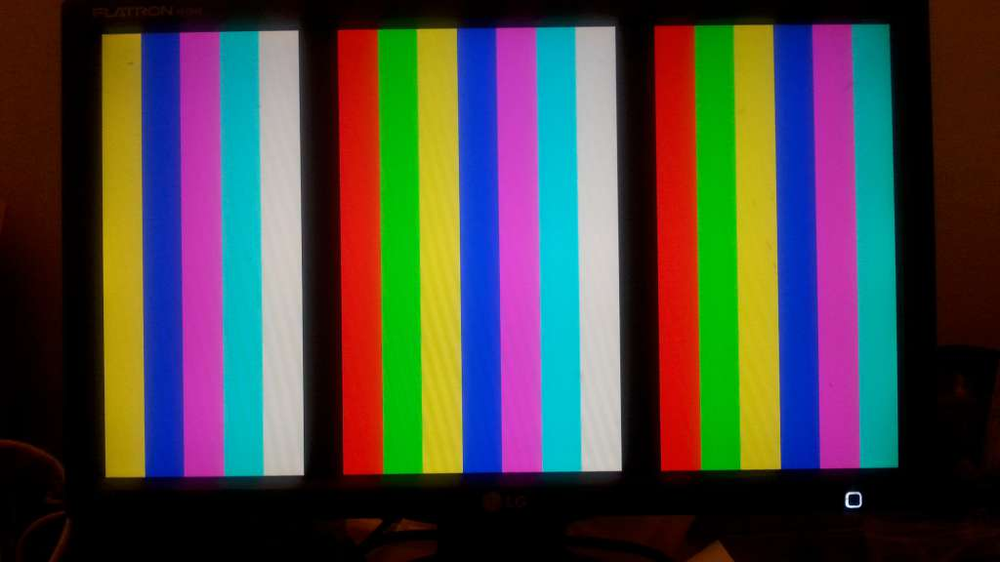
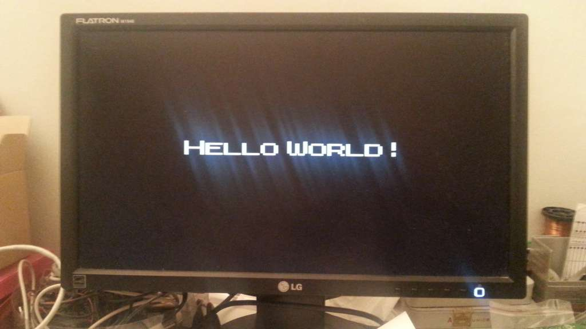

# VGA Demo
Mandatory VGA demo code running on a Chinese Low-Cost Cyclone IV Evaluation board A-C4E6E10 (https://www.aliexpress.com/item/USB-Blaster-altera-fpga-board-altera-kit-fpga-development-board-EP4CE6E22C8N-board-cyclone-IV-board/32813061054.html).

Developed on Quartus II version 13.1.4 web edition.

- 640 x 480 / 60 Hz / 8 color display
- 16 patterns (one per second)

- Hard-coded "Hello World!" bitmap

